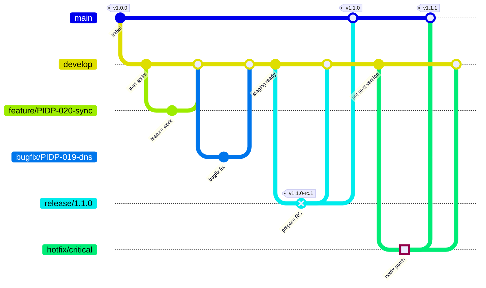

# Repository Guidelines

## Project Structure & Module Organization
Keep runtime logic in `src/` (e.g., `src/DnsPropagator`). Arrange HTTP or scheduling helpers under `src/<Project>/Services` and Pi-hole API clients in `src/<Project>/Clients`. Place integration glue (Dockerfile, compose samples, helm charts) under `deploy/`. Tests stay in `tests/`, mirroring namespaces from `src`. Put shared configuration samples or schema docs in `docs/` when they grow beyond inline README notes.

## Build, Test, and Development Commands
`dotnet restore` installs NuGet packages—run after cloning or altering dependencies. `dotnet build` compiles the solution and validates analyzers. Use `dotnet test --collect:"XPlat Code Coverage"` for the primary pipeline run; it produces coverage data in `TestResults/`. For container validation, run `docker build -t ghcr.io/<org>/pihole-dnspropagate .` from the repository root, followed by `docker run --env-file env.sample ghcr.io/<org>/pihole-dnspropagate`.

## Coding Style & Naming Conventions
Target .NET 9 and enable nullable reference types. Use four-space indentation, PascalCase for classes, camelCase for locals, and ALL_CAPS for environment variable constants. Keep each project with its own `Directory.Build.props` for analyzer configuration. Run `dotnet format` before opening a PR; the command enforces `csharp_style` rules and removes unused imports. Favor async APIs when interacting with the Pi-hole endpoints and wrap external calls in `IPiholeClient` abstractions for testing.
- When adding structured logging, treat EventId values as stable API surface. Never renumber existing IDs; append new IDs by choosing the next unused integer.

## Testing Guidelines
Adopt NUnit with FluentAssertions or built-in constraints, and use NSubstitute for mocking dependencies. Name test projects `<ProjectName>.Tests` and test files after the class under test (e.g., `DnsSyncServiceTests.cs`). Cover every public service and client method with at least one happy-path and one failure-path test; critical sync logic should reach 80% branch coverage. Exercise API integrations via test doubles that mimic Pi-hole responses; place reusable fixtures in `tests/Common`.
- Structure tests using the Arrange–Act–Assert pattern (annotate each section with comments `// Arrange`, `// Act`, `// Assert`).

## Branching & PR Workflow

- `main` is production-only. Update it through reviewed release PRs coming from `develop` (or coordinated hotfix branches).
- `develop` is the integration branch. Start feature and bugfix branches from here; use prefixes `feature/` or `bugfix/` with the related PIDP identifier when possible.
- Hotfix branches fork from `main`, are reviewed, then merged to both `main` and `develop`.
- Contributors working from forks should keep their fork in sync (`git fetch upstream && git rebase upstream/develop`), branch from `develop`, and open PRs back to `develop` unless maintainers request a hotfix. Run `dotnet test` (and any relevant integration suites) before marking a PR ready.
- `main` enforces branch protection: PRs must pass the `build` workflow and receive at least one maintainer approval; `develop` requires the same `build` check. Coordinate with maintainers if settings need adjustments.
- Workflows: `PR Validation` runs build/tests on every PR; `Release` (push to `main`) builds + pushes GHCR images, tags using `VERSION`, and drafts a GitHub Release with digests. Use `Manual Image Build` (workflow_dispatch) for RC or ad-hoc tags that must not update `latest`.

## Elevated Commands & Commits
- Inside the devcontainer, run Docker commands with `sudo` (for example `sudo docker build …`, `sudo docker compose …`). Scripts should do the same to avoid socket permission errors.
- Configure Git identity from `.codex/committer.env` before committing:
  ```bash
  source .codex/committer.env
  git config user.name "$GIT_AUTHOR_NAME"
  git config user.email "$GIT_AUTHOR_EMAIL"
  ```
- Avoid `git commit -m`. Instead, write commit messages to a file (or use `git commit -F`) so backticks or Markdown aren’t mangled. After each commit, run `git log -1 --pretty=medium`; if the `Changes:`/`Validation:` sections look off, amend immediately.
- Before staging, ensure the linked backlog item on the GitHub Project board has its work items / acceptance criteria checked off and its status set to `Done` once the change is ready.
- When working with Pi-hole credentials, review `docs/security.md` for guidance—never log passwords and prefer env vars or secret managers.

## Integration Testing Workflow
- Follow `docs/pihole-sandbox.md` when bringing up the primary/secondary Pi-hole sandbox.
- Run sandbox commands with `sudo` inside the devcontainer so Docker can access `/var/run/docker.sock`.
- After `sandbox.sh up`, capture container IPs with `sudo docker inspect` and export `SANDBOX_PIHOLE_URL`/`SANDBOX_PIHOLE_SECONDARY_URL` using those addresses (requests to `127.0.0.1` fail from the devcontainer).
- Explicit integration tests stay skipped by default; target them with `dotnet test --filter FullyQualifiedName=...` once the sandbox is running.
- Tear the sandbox down with `sudo ./deploy/pihole-sandbox/sandbox.sh down` when finished to keep future runs clean.

## Commit & Pull Request Guidelines
Write commits using the template `type(scope): summary`, followed by `Changes:` and `Validation:` sections listing granular edits and commands run. Acceptable types: `feat`, `fix`, `chore`, `docs`, `test`, `build`, `refactor`, `perf`, `ci`, `revert`. Keep summaries ≤72 characters, imperative, and scope optional but descriptive (`sync`, `teleporter-client`). Reference related issues in the `Refs:` line (`Refs #12`) when applicable. PRs need a concise summary, validation evidence (command output or screenshots for tooling), and a checklist for secrets: confirm API keys are mocked and configs exclude real tokens. Request review from @maintainers once CI is green and tag new configuration knobs in the release notes draft.
- Only create commits when explicitly instructed by the user; otherwise keep work staged for review.
- Do not run `git commit` (or any history-modifying command) unless the user explicitly asks for a commit. Stage your changes, summarize them, and wait for approval before committing.

## Backlog Item Standards
Manage the backlog exclusively through the GitHub Project board at `https://github.com/users/thomaslazar/projects/1`. Create draft items titled `PIDP-### – summary`, and use the Markdown scaffold from `plan/backlog/template.md` for the body so every item contains Context, Work Items, Acceptance Criteria, Notes, and explicit Prerequisites. Track progress by moving items across the project’s workflow columns (Backlog → Ready → In progress → In review → Done). Update checkboxes as you complete work and move the item to `Done` once the acceptance criteria are satisfied.

## Security & Configuration Tips
Never commit real Pi-hole API keys; provide masked examples in `.env.example`. When introducing new configuration, document defaults in `docs/configuration.md` and ensure the Docker image reads settings via environment variables only.
