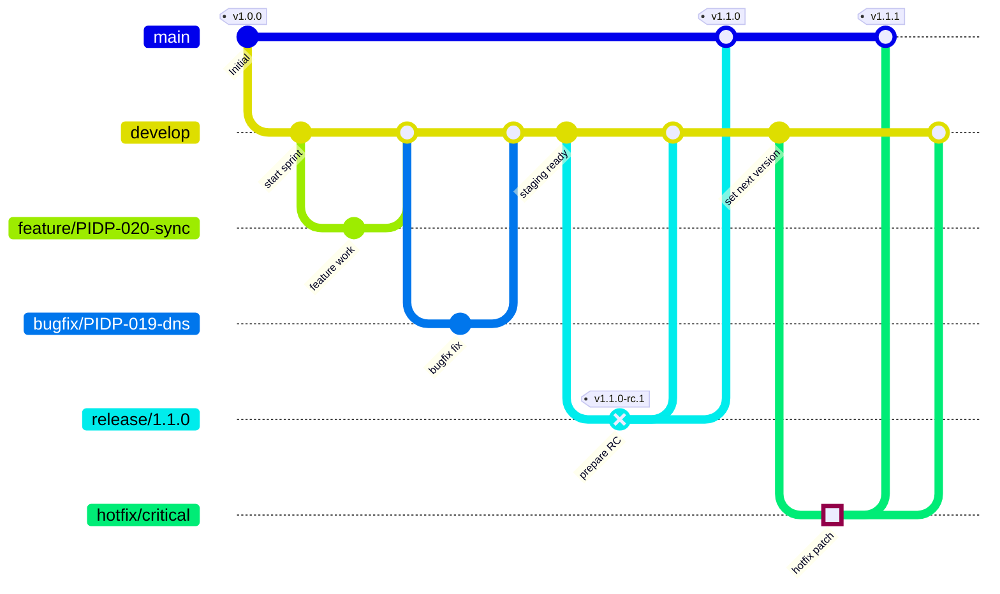

# Contributing Guide

Welcome! This document covers everything you need to get productive with **pihole-dnspropagate**, including development environments, testing strategies, and release considerations.

## Table of Contents
- [Project Stack](#project-stack)
- [Development Environments](#development-environments)
  - [Dev Container](#dev-container)
  - [Local .NET Setup](#local-net-setup)
- [Running the Worker](#running-the-worker)
  - [Docker](#docker)
  - [Manual CLI](#manual-cli)
- [Pi-hole Test Environments](#pi-hole-test-environments)
  - [Docker Sandbox](#docker-sandbox)
  - [Testcontainers Integration Tests](#testcontainers-integration-tests)
- [Testing & Coverage](#testing--coverage)
- [Coding Standards](#coding-standards)
- [Git & Backlog Workflow](#git--backlog-workflow)
- [Tooling & Automation](#tooling--automation)
- [Release Checklist](#release-checklist)

---

## Project Stack
- **Language/Runtime:** .NET 9 (nullable enabled, LangVersion `preview`).
- **Worker:** `PiholeDnsPropagate.Worker` hosts the scheduler, health endpoint, and CLI via Spectre.Console.
- **Core library:** `PiholeDnsPropagate` provides teleporter client, archive processing, and options bindings.
- **Testing:** NUnit, NSubstitute, FluentAssertions, Coverlet for coverage, Testcontainers for integration.
- **Linting/analysis:** Roslyn analyzers via `Directory.Build.props` and .NET tuning (warnings treated as errors for main projects).
- **Containerization:** Multi-stage Dockerfile producing a runtime image; compose files for dev/prod usage.

## Development Environments

### Dev Container
The repo ships with a VS Code dev container definition. Opening the project in VS Code with Dev Containers installs:
- .NET 9 SDK, Node.js tooling, GitHub CLI.
- Requested extensions (Copilot, GitLens, Git Graph, ESLint, etc.).
- OpenAI Codex CLI, GitKraken CLI, and configured MCP servers.
- Docker CLI & compose plugin so you can run local containers/testcontainers.

`devcontainer.json` also sets `CODEX_HOME` to `.codex`, installs the Codex CLI config, and exposes environment defaults needed for agentic workflows.

### Local .NET Setup
If you prefer local development without the container:
1. Install .NET 9 SDK (`dotnet --version` should report 9.x).
2. Restore dependencies:
   ```bash
   dotnet restore
   ```
3. Build all projects:
   ```bash
   dotnet build
   ```
4. Install Docker Desktop / Docker Engine for Testcontainers and runtime testing.

## Running the Worker

### Docker
- Build the image from the repo root:
  ```bash
  docker build -t pihole-dnspropagate:dev .
  ```
- Launch via compose (dev stack builds from source):
  ```bash
  docker compose -f deploy/compose/docker-compose.dev.yaml up -d
  ```
- For registry-backed deployments, use `deploy/compose/docker-compose.prod.yaml` and replace the image tag with your GHCR path.
- Configure env vars using `.env.dev` (template included). Customize primary/secondary URLs, passwords, scheduling, and log levels.
- Trigger manual syncs without waiting for the scheduler:
  ```bash
  docker compose run --rm pihole-dnspropagate sync-now
  ```
- Health endpoint (`/healthz`) is exposed on port `HEALTH_PORT` (default 8080). Compose examples publish it on the host.

### Manual CLI
You can also run the worker directly:
```bash
dotnet run --project src/PiholeDnsPropagate.Worker
```
Pass `sync-now` to execute a one-off sync:
```bash
dotnet run --project src/PiholeDnsPropagate.Worker -- sync-now
```

## Pi-hole Test Environments

### Docker Sandbox
A manual sandbox lives under `deploy/pihole-sandbox/`. It spins up multiple Pi-hole containers for exploratory testing:
- Follow `docs/pihole-sandbox.md` for instructions on bringing up primary/secondary instances.
- Use this sandbox to inspect Pi-hole UIs, test API behaviors, or seed specific DNS entries.

### Testcontainers Integration Tests
Automated integration tests (NUnit) leverage Testcontainers to provision Pi-hole instances on demand:
- Tests live under `tests/PiholeDnsPropagate.Tests/Integration/`.
- They are marked `[Explicit]` when they require real Pi-hole containers. Set `SANDBOX_PIHOLE_*` environment variables to target your sandbox if you want to run them manually.
- CI skips these when Docker isn’t available, but local runs can exercise the full pipeline.

When running the integration suite, ensure the Docker daemon is accessible; otherwise, the tests will be marked inconclusive.

## Testing & Coverage
- Standard test command:
  ```bash
  dotnet test /p:CollectCoverage=true /p:CoverletOutput=TestResults/coverage/ /p:CoverletOutputFormat=cobertura%2copencover /p:Threshold=80 /p:ThresholdType=line /p:ThresholdStat=total
  ```
- Unit tests cover options binding, scheduler/CLI logic, teleporter archive processing, etc.
- Additional worker tests ensure health endpoint behavior, session teardown, and scheduler edge cases.
- Coverage thresholds are enforced via Coverlet (line coverage ≥ 80%).

## Coding Standards
- Nullable enabled; treat warnings as errors (`TreatWarningsAsErrors=true`) in main projects.
- Use async APIs for network operations and prefer `ConfigureAwait(false)` inside library code.
- Linters/analyzers run on build; fix CA/IDE warnings as they appear.
- Tests follow Arrange/Act/Assert structure with explicit comments (See `README`/AGENTS.md note).
- Keep manual logging using `LoggerMessage` to satisfy CA1848.

## Branching Model

We use a lightweight GitFlow-inspired model to keep day-to-day development moving while protecting production quality.



- **main** – production branch. Only updated through reviewed release PRs. Every commit here must be shippable.
- **develop** – integration branch. All regular work merges here first.
- **feature/** and **bugfix/** branches – short-lived branches cut from `develop` (forks should use the same prefixes). Merge back via PR once tests pass.
- **hotfix/** branches – emergency patches forked from `main`, merged back into both `main` and `develop` after review.

### Working From Forks
- Create a feature/bugfix branch on your fork (e.g., `feature/PIDP-020-new-sync-mode`).
- Keep your fork up to date by rebasing on `upstream/develop` before opening a PR.
- Target `develop` in PRs unless you are coordinating a hotfix with the maintainers.
- Run `dotnet test` (and sandbox integration tests if relevant) before submitting.
- GitHub Actions will run the required `build` job on every PR; resolve failures before requesting review.
- Branch protection requires at least one maintainer approval on `main` before merge; expect review feedback.

## Git & Backlog Workflow
- Backlog items are tracked on the GitHub Project board: <https://github.com/users/thomaslazar/projects/1>. Create entries titled `PIDP-### – summary` and paste the Markdown scaffold from `plan/backlog/template.md` into the body (Context, Work Items, Acceptance Criteria, Notes).
- Move project items through the workflow columns (Backlog → Ready → In progress → In review → Done) and update checkboxes as tasks are completed.
- Commits follow `type(scope): summary` per repo guidelines (documented in AGENTS.md/README).
- Avoid committing without explicit user instruction (per AGENTS.md).
- Large features should reference backlog IDs in commit messages or PR descriptions.

## Tooling & Automation
- **PR Validation:** `.github/workflows/pr-validation.yml` runs build/tests/coverage on every PR (forks included) so branch protection checks pass.
- **Release:** `.github/workflows/release.yml` tags `main` as `vX.Y.Z`, builds images, and drafts GitHub Releases with digests.
- **Manual Image Build:** `.github/workflows/manual-image-build.yml` publishes release-candidate or ad-hoc tags without updating `latest`.
- Dev container installs OpenAI Codex CLI, GitKraken CLI, and sets up MCP servers; manual usage is described in `AGENTS.md`.

## Credential Handling
- Pi-hole’s API requires plaintext passwords. Supply them via environment variables, Docker/Kubernetes secrets, or secret managers—never commit real credentials.
- `.env.dev` only supplies **placeholder** values (e.g., `<set-primary-password>`). Copy it and replace the placeholders locally before running the service.
- Review the [security guidance](security.md) before modifying authentication or logging code.

## Release Checklist
1. Ensure backlog items for the release are marked `Done` on the GitHub Project board.
2. Run full test suite with coverage and (optionally) Testcontainers integration tests.
3. Build/push Docker image (until automation in PIDP-017):
   ```bash
   docker buildx build --platform linux/amd64 -t ghcr.io/thomaslazar/pihole-dnspropagate:<tag> --push .
   ```
4. Update changelog / release notes with notable changes.
5. Merging into `main` triggers `.github/workflows/release.yml`, which builds/pushes `ghcr.io/thomaslazar/pihole-dnspropagate` images (`<version>` + `latest`), tags the commit, and drafts a GitHub release including the image digest summary.
6. For release-candidate images, run `.github/workflows/manual-image-build.yml` via **Actions → Manual Image Build → Run workflow**, specify a tag (e.g., `1.0.0-rc.1`), and publish without disturbing `latest`.
7. If automation fails, follow the manual fallback in `docs/release-process.md` (log in to GHCR, push tags, edit release notes) before announcing the release.

Happy hacking! If you run into issues, open an issue or ping the maintainers.
