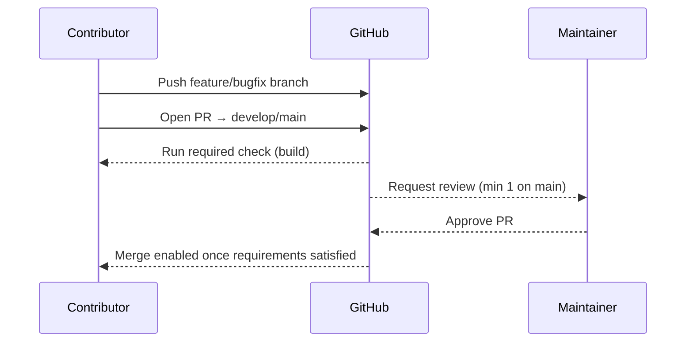

# Release Process Overview

This document outlines the current release governance for **pihole-dnspropagate**. It will expand as automation (tagging, packaging, publishing) evolves.

## Branch Protection Rules

| Branch   | Required Settings                                                                                               |
|----------|------------------------------------------------------------------------------------------------------------------|
| `main`   | Pull requests only, ≥1 maintainer approval, status check `build` must pass, linear history.                      |
| `develop`| Pull requests only, status check `build` must pass (reviews optional but recommended).                           |

**Sanity checks after updating rules**
1. Direct pushes to `main` / `develop` are rejected.
2. PRs cannot merge until the `build` workflow succeeds.
3. `main` requires an approving review from a maintainer before merge.

## Version Source of Truth

- Repository root contains a `VERSION` file with the semantic version (e.g., `1.0.0`).
- `Directory.Build.props` reads this file and sets `Version`, `FileVersion`, and `InformationalVersion` for every project.
- Docker, packaging, and release workflows must reference the same version string when tagging artifacts.

### Bumping the Version

| Change Type | When to Use                               | Action                                                                 |
|-------------|--------------------------------------------|------------------------------------------------------------------------|
| Patch       | Bug fixes/hotfixes without new features    | Update `VERSION` to `major.minor.(patch+1)` (e.g., `1.0.1`).            |
| Minor       | Backwards-compatible features              | Update to `major.(minor+1).0` (e.g., `1.1.0`).                          |
| Major       | Breaking changes or significant rewrites   | Increment `major+1`.0.0 (e.g., `2.0.0`).                                |

Commit the version change on a feature branch, reference the relevant PIDP item, and open a PR targeting `develop`.

## Release Workflow

```mermaid
flowchart LR
    A[Feature work merged into develop] --> B[Prepare release branch]
    B --> C[Update VERSION if needed]
    C --> D[PR develop → main]
    D --> E[CI build + tests pass]
    E --> F[Maintainer approval]
    F --> G[Merge to main]
    G --> H[Tag vX.Y.Z]
    H --> I[Publish release notes & images]
    I --> J[Merge back to develop if hotfix]
```

1. Ensure `develop` is green and contains all commits for the release.
2. Update `VERSION` if the release jump requires it; commit on a short-lived release branch.
3. Open a PR from the release branch (or `develop`) into `main`. CI must pass and at least one maintainer must approve.
4. After merge, tag the release commit as `vX.Y.Z` and trigger packaging workflows (container publish, etc.).
5. Draft GitHub Release notes summarising changes, linking backlog items, and including artifact references.
6. If a hotfix originated from `main`, merge the release branch back into `develop` to keep histories aligned.

GitHub Actions automation:
- The `PR Validation` workflow runs on every PR to `develop` or `main`, ensuring build/test coverage before merge.
- When new code lands on `main`, the `Release` workflow reads `VERSION`, tags the commit as `vX.Y.Z`, and drafts a GitHub Release with generated notes. If the tag already exists, the workflow exits with no changes.

### Rollback Strategy

- **Before announcing the release**: If CI or smoke tests fail, revert the merge commit on `main`, delete the tag (e.g., `git tag -d vX.Y.Z && git push origin :refs/tags/vX.Y.Z`), and reopen the release PR after fixes.
- **After publication**: Create a hotfix branch from the last known good tag, revert the problematic commits, bump `VERSION` with a patch release, and follow the release workflow above.
- Always document rollback actions in the GitHub Release notes to maintain traceability.

## Fork Pull Requests

- External contributors target `develop` unless coordinating a hotfix with maintainers.
- The `build` workflow runs on all PRs (triggered by `pull_request`) and satisfies branch protection.
- Keep “Allow edits from maintainers” checked so reviewers can help with minor fixes.
- If a workflow needs repository secrets, run it from the maintainer fork instead of lowering protections.

## Future Enhancements

Backlog items (PIDP-015+) will extend this guide with:
- Version source of truth (`VERSION` file / MSBuild property).
- Automated tagging & GitHub Release instructions.
- GHCR publishing workflow and end-to-end release checklist.
