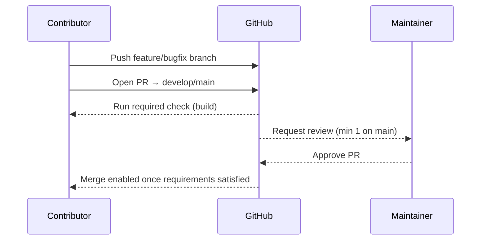

# Release Process Overview

This document outlines the current release governance for **pihole-dnspropagate**. It will expand as automation (tagging, packaging, publishing) evolves.

## Branch Protection Rules

| Branch   | Required Settings                                                                                               |
|----------|------------------------------------------------------------------------------------------------------------------|
| `main`   | Pull requests only, ≥1 maintainer approval, status check `build` must pass, linear history.                      |
| `develop`| Pull requests only, status check `build` must pass (reviews optional but recommended).                           |

**Sanity checks after updating rules**
1. Direct pushes to `main` / `develop` are rejected.
2. PRs cannot merge until the `build` workflow succeeds.
3. `main` requires an approving review from a maintainer before merge.

## Fork Pull Requests

- External contributors target `develop` unless coordinating a hotfix with maintainers.
- The `build` workflow runs on all PRs (triggered by `pull_request`) and satisfies branch protection.
- Keep “Allow edits from maintainers” checked so reviewers can help with minor fixes.
- If a workflow needs repository secrets, run it from the maintainer fork instead of lowering protections.

## Future Enhancements

Backlog items (PIDP-015+) will extend this guide with:
- Version source of truth (`VERSION` file / MSBuild property).
- Automated tagging & GitHub Release instructions.
- GHCR publishing workflow and end-to-end release checklist.
